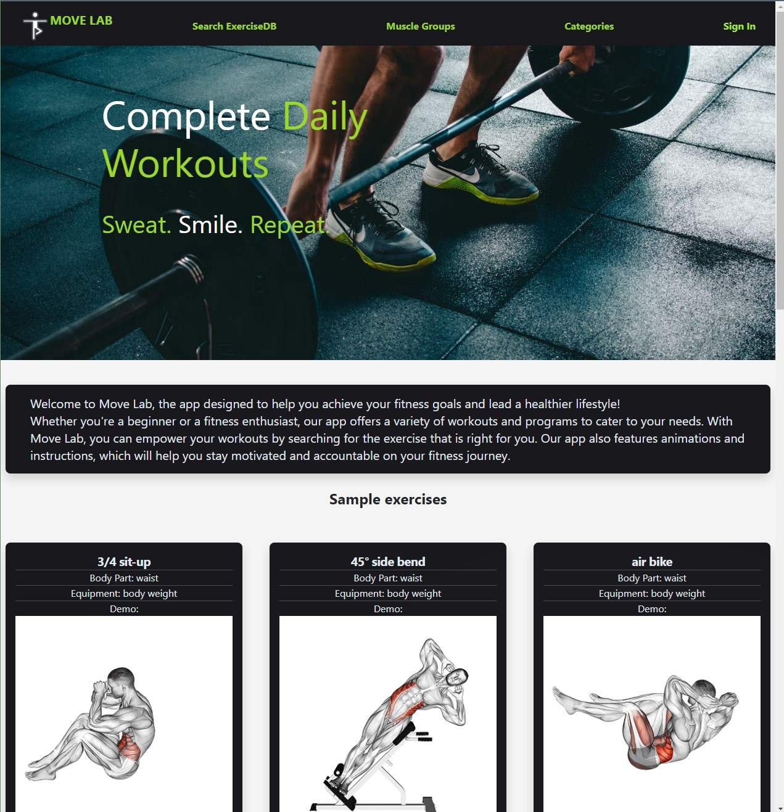
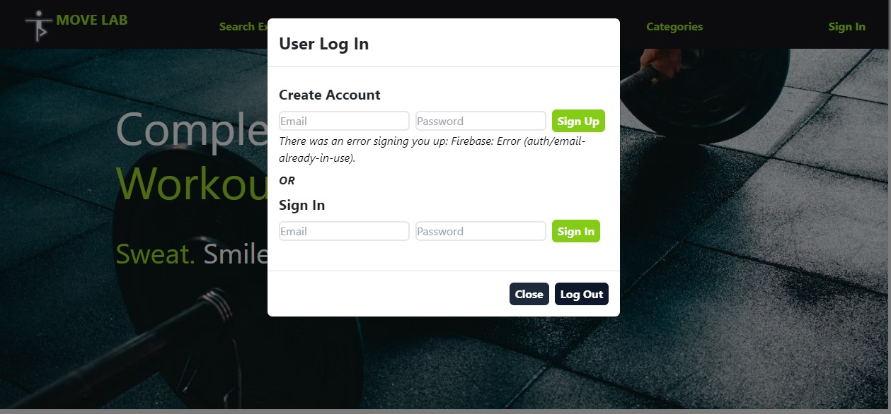

# MOVE LAB

## Author: Chris Loveless

---
### Description: 

Move Lab is a modern fitness web application. It uses ExerciseDB and Ninja-API to provide a robust resource of exercises. Users can search various parameters to filter thousands of results to find or explore exercises. These parameters include, muscle groups, fitness categories, body parts, and equipment. Animations are used to provide a demonstration of the exercises found. Firebase is also used for Authentication concerns.

---

### Website 





---

## Project Setup 

1. Clone this repo to your desktop.
2. Navigate to the project directory and run `$ npm install`.
3. Add a `.env` file to the .gitignore and commit the change.
4. Add a `.env` file to the root directory.
5. Follow the [steps here](https://www.learnhowtoprogram.com/react/react-with-nosql/adding-firebase-to-react) to create your .env file.

### `.env` Setup

1. Use this template below to setup your .env file

```js
REACT_APP_FIREBASE_API_KEY = "YOUR-UNIQUE-CREDENTIALS"
REACT_APP_FIREBASE_AUTH_DOMAIN = "YOUR-PROJECT-NAME.firebaseapp.com"
REACT_APP_FIREBASE_PROJECT_ID = "YOUR-PROJECT-FIREBASE-PROJECT-ID"
REACT_APP_FIREBASE_STORAGE_BUCKET = "YOUR-PROJECT-NAME.appspot.com"
REACT_APP_FIREBASE_MESSAGING_SENDER_ID = "YOUR-PROJECT-SENDER-ID"
REACT_APP_FIREBASE_APP_ID = "YOUR-PROJECT-APP-ID"
```
### Rapid API Setup

1. Create an account at [rapidapi.com](https://rapidapi.com/) and add your key to the .env file.

```js
REACT_APP_RAPID_API_KEY= "YOUR-RAPID-API-KEY"
```

---

## Available Scripts

In the project directory, you can run:

### `npm start`

Runs the app in the development mode.\
Open [http://localhost:3000](http://localhost:3000) to view it in your browser.

The page will reload when you make changes.\
You may also see any lint errors in the console.

### `npm test`

Launches the test runner in the interactive watch mode.\
See the section about [running tests](https://facebook.github.io/create-react-app/docs/running-tests) for more information.

### `npm run build`

Builds the app for production to the `build` folder.\
It correctly bundles React in production mode and optimizes the build for the best performance.


